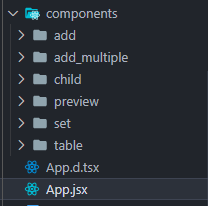
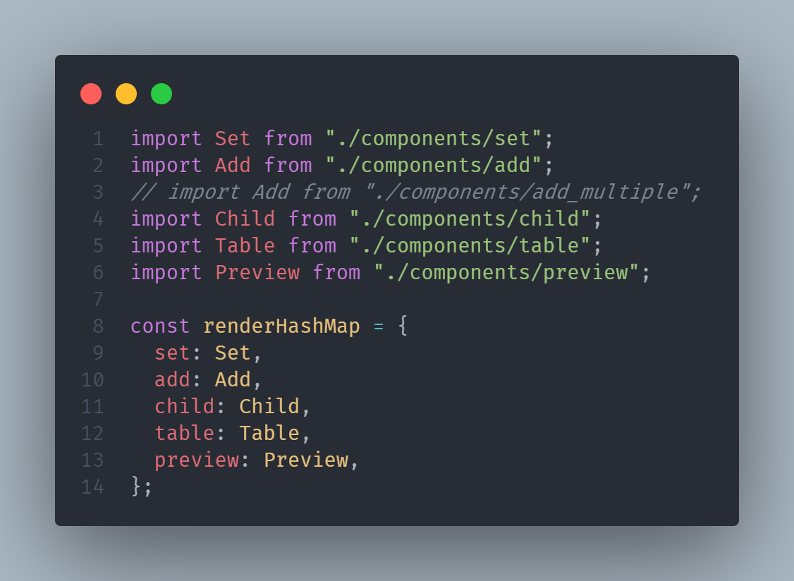

本节介绍如何使用开发框架进行应用插件开发，关于开发框架的通用使用方式，参考**开发框架**一节。

## 下载代码

## 配置文件

```JSON
{
  "id": "4519b44f-8f66-47ca-bdbf-75d655206b47-asd",
  "type": "reporting",
  "main": "main.6f3aa0c9.js",
  "version": "2",
  "props": {
    "styleArr": "[\"title\",\"key\", \"eventCenterConfig\"]",
    "columnStyle": "{title:'自定义'}",
    "componentAttributes": "{\"style\":[\"title\"],\"data\":[\"key\"],\"interaction\":[\"eventCenterConfig\"]}",
    "assetColumnList": "[{\"col_name\":\"自定义\",\"col_datatype\":0}]"
  }
}
```

## 配置文件说明

- `id`: 插件唯一 id,同 id 插件不能重复上传
- `type`: 插件类型
- `main`: 入口文件
- `version` 版本，当前版本版固定为"2"
- `props`业务属性

### props

- `code` 插件的唯一标识，每次打包插件这个值会自动生成，不需要手动更改
- `content` 必须为 `customize`
- `name` 插件的名称
- `componentAttributes` 设计页使用组件时，会根据此字段为用户渲染配置项，如：**title**: 标题，**key**: 绑定字段。没有特殊要求，默认即可
- `columnStyle` 组件属性，没有特殊要求，默认即可
- `assetColumnList` 绑定字段，详细要求见 [API/onChange](./API.md)章节

## 文件说明

### 示例组件



- `set` 填报设计页 demo
- `add` 填报新增编辑主表 demo
- `add_multiple` 同填报新增编辑主表，但为多字段 demo
- `child` 填报新增编辑子表 demo
- `table` 填报列表页 demo
- `preview` 填报详情页 demo
- `designConfiguration` 填报设计组件配置 demo


renderHashMap 的 key 即为组件对应的页面 type

**页面 type**:

- `set` 填报设计页
- `add` 填报新增编辑主表
- `child` 填报新增编辑子表
- `table` 填报列表页
- `preview` 填报详情页
