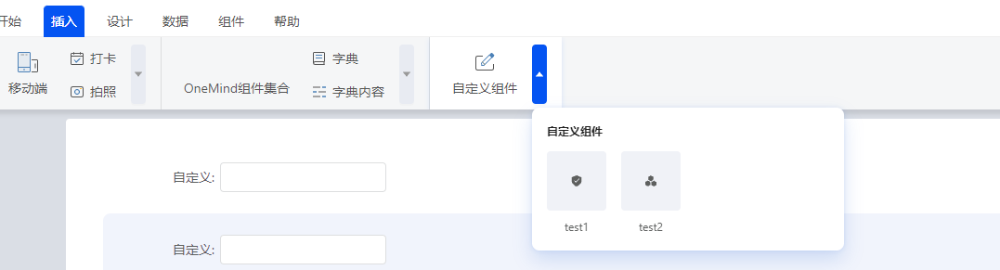
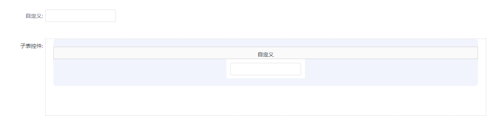
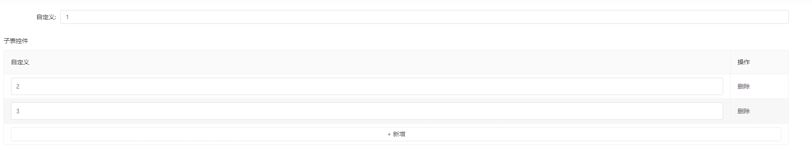
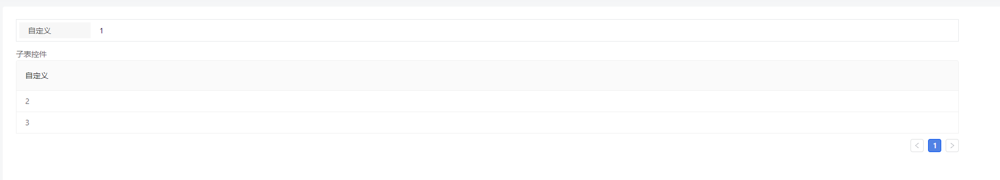

1. 找到待插入的组件

   

   

1. 进入视图列表-保存
1. 打开填报列表页
1. 点击新增按钮

   

   看到主表和子表都有自定义组件

   对应的`type`为`add` 和 `child`

   此时想要保存值，需触发`props.onChange`

   

   点击保存

1. 返回到列表页

   

   看到列表页也有自定义组件，对应`type`为`table`

   此时`props.data`值为`"1"`

1. 点击编辑页

   

   此时进入填报编辑页，对应的`type`仍然为`add` 和 `child`

   但是此时

1. 主表的 自定义组件 Add 的 `props.data`值为`"1"`
1. 子表下有两个个自定义组件 Child

   `props.data`值分别为`"2"`， `"3"`

   修改值，仍然会触发`props.onChange`

1. 返回列表页，点击详情页

   

   此时

   - 主表的 自定义组件： `type`为 ’preview‘ ， `props.data`值为`"1"`
   - 子表下有两个个自定义组件：

     `type`为 `table` `props.data`值分别为`"2"`， `"3"`
