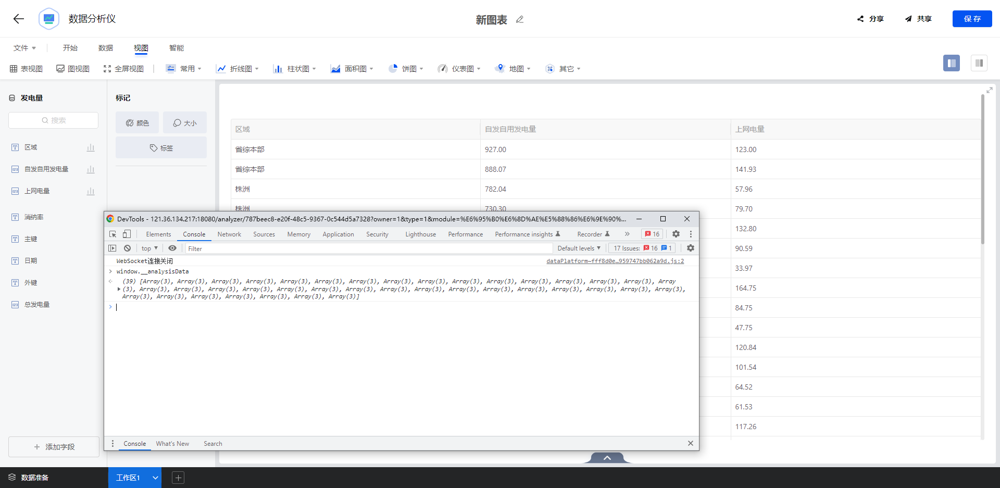
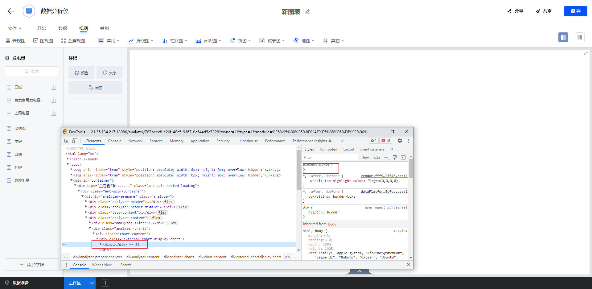

## 平台问题


## 插件问题

### 分析仪
#### 平台版本问题 

##### 1.在R4C10环境中无法获取资产数据

获取配置资产数据使用 window._analysisData  去获取资产数据



#####   2. 当包上传渲染都无问题时 分析仪组件无法显示 可能是平台外面有级div没有高度导致


 解决方法：

```
this.$refs.analyzer.parentNode.style.height = "100%" //  this.$refs.analyzer 为组件最外的dom元素
this.$refs.analyzer.parentNode.style.width = "100%"
```


### 大屏
### 应用
### 填报